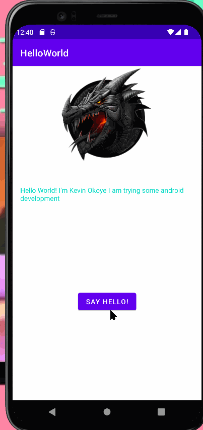

<<<<<<< HEAD
# Android Prework - *Hello World*

Submitted by: **Your Name Here**

**Name of your app** is an android app that shows an image and introductory message, and allows pressing a button to display a Toast. 

Time spent: **2** hours spent in total

## Required Features

The following **required** functionality is completed:

* [x] Image and introductory message displayed on screen
* [x] Button displayed on screen
* [x] Toast with message appears when button is pressed 

The following **optional** features are implemented:

* [ ] List anything else that you can get done to improve the app functionality!

## Video Walkthrough

Here's a walkthrough of implemented features:

<!-- Replace this with whatever GIF tool you used! -->
GIF created with LiceCap 
<!-- Recommended tools:
[Kap](https://getkap.co/) for macOS
[ScreenToGif](https://www.screentogif.com/) for Windows
[peek](https://github.com/phw/peek) for Linux. -->

## Notes

I had a lot of trouble with differences between the walkthrough UI's and the ones I have for android studio It made me go on a little bit of a goose chase to figure
out why my code was not committing correctly and why it did not look the same way the walkthroughs did. It honestly made me turn it in late. I had just heard about code path thanks to my school University of Maryland - College Park doing a resume review for out career fair that was sponsored from them. I would still love to be able to enroll in this course after hearing about all the things that I can do at these CodePath courses and how after seeing how intricate these walkthroughs are I learned so much about git, android studio, and kotlin in just a few short hours. I would love to be apart of this learning community. 

## License

    Copyright [yyyy] [name of copyright owner]

    Licensed under the Apache License, Version 2.0 (the "License");
    you may not use this file except in compliance with the License.
    You may obtain a copy of the License at

        http://www.apache.org/licenses/LICENSE-2.0

    Unless required by applicable law or agreed to in writing, software
    distributed under the License is distributed on an "AS IS" BASIS,
    WITHOUT WARRANTIES OR CONDITIONS OF ANY KIND, either express or implied.
    See the License for the specific language governing permissions and
    limitations under the License.
=======
"# h" 
>>>>>>> 268989e (intial Commit)
